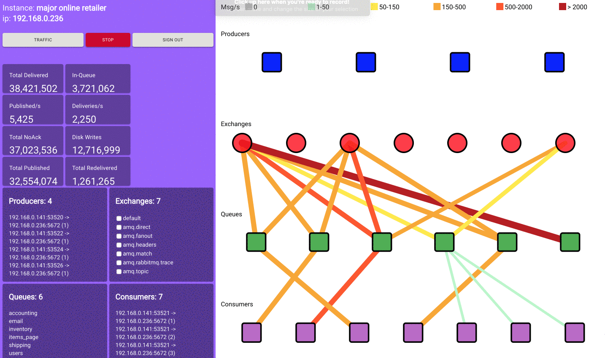

# AliceMQ - RabbitMQ Visualizer

We use the RabbitMQ management plugin API to query multiple endpoints: overview, queues, exchanges, bindings, channels - then parse the data and re-pipe it into a D3.js/React app. The app is meant to focus on traffic flowing into the system and show which exchanges are getting hit and how hard.





## Getting Started

These instructions will get you a copy of the project up and running on your local machine for development and testing purposes. See deployment for notes on how to deploy the project on a live system.

### Prerequisites

We have pre-built packages available for Windows, MacOSX, Linux. Please visit [AliceMQ](https://alicemq.com) download page.

For MacOSX and Linux platforms, please ensure to have git and npm installed.

### Manual Install

If you want build your own electron app, please follow the following instruction.

```
git clone https://github.com/alicelabs/alicemq.git
cd alicemq
npm run buildapp
```
For Mac and Windows build:
```
npm run buildappwin
npm run buildappmac
```
Once the command finishes, please find the executable electron app in its subfolder. The app is specific built for the platform which you are running.

For Linux:
We haven't yet packaged the production build for Linux. You can package it yourself or run it in development mode. 
```
npm run app
```


## Testing AliceMQ with your server

To help you test the app is working correctly with your RabbitMQ server, we provide you with [AliceMQ testing suite](https://github.com/alicelabs/alicemq-test-suite). It is a series of producer and consumer scripts that can simulate all types of RabbitMQ messages: Direct, Topic, Header and Fanout. Please see detailed instruction on its [readme](https://github.com/alicelabs/alicemq-test-suite).

## Troubleshooting

### Web App not Working

Since the current script is built for the electron build, the web app may not work out of the box. Please modify

in ./Clinet/Containers/Main.jsx - Change isWeb false to true 
```
isWeb: true
```
then run the script
```
npm run web
```

### Connecting to Cloud Services
AliceMQ suppports both local and cloud RabbitMQ instance like **AWS**. If you have problem with connection please check:
* Check internet connectivity.
* RabbitMQ server is running.
* Double check username and password to log into RabbitMQ.
* Ensure RabbitMQ port is correct, open and forward.
* Still having issues, continue reading below.

### CORS
When accessing the rabbitmq API remotely on a network, you'll need to whitelist your ip to allow for cross origin fetching. Check out this page on how to setup [configure](https://www.rabbitmq.com/management.html#cors) file

If running on AWS EC2 server:
* SSH into your EC2 server.
* Edit your RabbitMQ config file.
* Edit EC2 security group to open RabbitMQ port in inbound rules.

### Color Legend

If you'd like to modify the color legend ranges to better suit your RabbitMQ instance's throughput. Two simple modifications need to be made.
```
## /client/Components/Legend.jsx ##

let ranges = [['0', '#bdbdbd'], ['1-50', '#b9f6ca'], ['50-150', '#ffeb3b'], ['150-500', '#f9a825'], ['500-2000', '#ff5722'] , ['> 2000', '#b71c1c']]
```

The ranges are static values in the 1st element of the sub arrays

```
## /client/Components/NetworkGraph.jsx ##

function setRateColor(rate){
  let lineColor = '';
  if (rate === 0) { lineColor = '#bdbdbd' } 
  else if (rate > 0 && rate <= 50) { lineColor = '#b9f6ca' }
  else if (rate > 50 && rate <= 150) { lineColor = '#ffeb3b' }
  else if (rate > 150 && rate <= 500) { lineColor = '#f9a825' }
  else if (rate > 500 && rate <= 2000) { lineColor = '#ff5722' }
  else if (rate > 2000) { lineColor = '#b71c1c' }
  return lineColor;
}
```

Be sure to have the static ranges in the Legend component match in the setRateColor function and you're all set. 
## Built With

* [React](https://reactjs.org/docs/getting-started.html) - Framework used
* [Electron](https://maven.apache.org/) - Build cross-platform application
* [D3](https://github.com/d3/d3/wiki) - Used to draw graphs
* [RabbitMQ](https://www.rabbitmq.com/documentation.html) - Message broker and underlining technology

## Versioning

v1.0.1

## Authors

[Anthony Valentin](https://github.com/vhsconnect), [Christian Niedermayer](https://github.com/Chris-N), [Parket Allen](https://github.com/csrudy), [Siye Sam Yu](https://github.com/yudataguy)

## License

[Mozilla Public License 2.0](https://www.mozilla.org/en-US/MPL/2.0/)

## Acknowledgments

* [RabbitMQ User Group](https://groups.google.com/forum/#!forum/rabbitmq-users)
